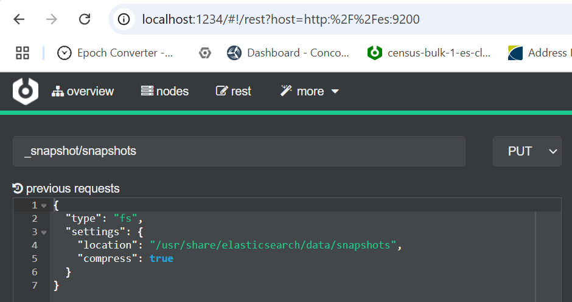
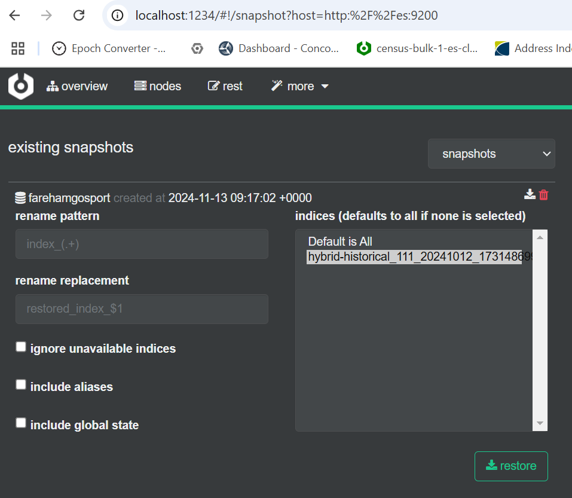
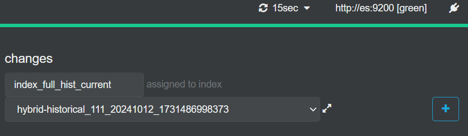
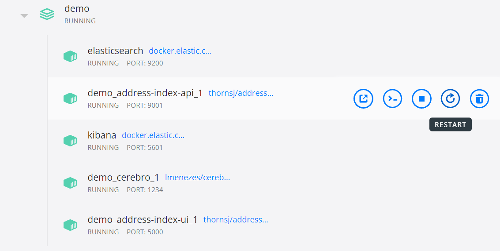
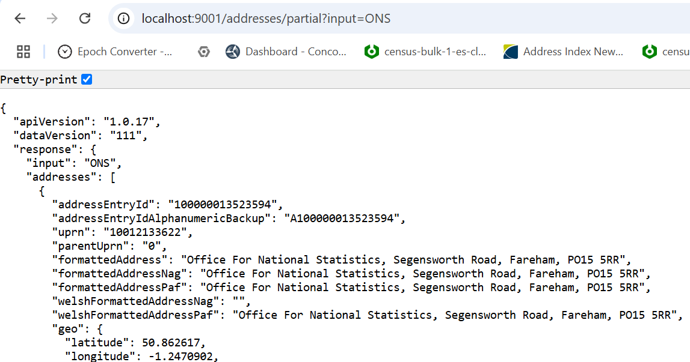

### How do I use the Docker Demo with my own ABP Index? ###

First you have to create an Elasticsearch index with a subset of Local Authorities (selected via localCustodianCodes) using the instructions at

https://github.com/ONSdigital/aims-spark?tab=readme-ov-file#indices-for-specific-las

Then you need to run the alternative Docker Compose script in this directory

1) Run ```docker-compose up``` on https://github.com/ONSdigital/aims-api/blob/main/customdata/docker-compose.yml

2) The cluster status can be viewed with either Cerebro or Kibana:

        Cerebro: http://localhost:1234
        and then http://es:9200
    
        Kibana: http://localhost:5601
    (the compose file has kibana commented out, you can uncomment it if you want to use it)

You will see that there are no indices in the cluster. This means the API will not work.

3) Restore your index to the cluster.

Create an empty directory on your local machine and copy your snapshot to it.
The exact command depends on where the index is stored, the example below is for a GCS bucket:

        gsutil -m cp -r gs://aims-test-index-bucket/* .

Now copy the snapshot to the data directory of the Elasticsearch cluster in Docker.

        docker cp . elasticsearch:/usr/share/elasticsearch/data/snapshots

If using Podman on Windows the command is

        podman machine ssh "podman cp /mnt/c/users/myuser/mysnap1/. elasticsearch:/usr/share/elasticsearch/data/snapshots" 
(replace users/myuser/mysnap1 with the actual directory)

Now you can use Cerebro or Kibana to restore the index as shown below:

First create a repository that points to snapshot directory inside Docker.

        PUT _snapshot/snapshots
        {
          "type": "fs",
          "settings": { "location": "/usr/share/elasticsearch/data/snapshots", "compress": true }
        }
  

Then restore the index from the snapshot.

  

Then add some aliases to the index:

        index_full_hist_current
        index_full_nohist_current
        index_full_hist_111
        index_full_nohist_111
        index_skinny_hist_current
        index_skinny_nohist_current
        index_skinny_hist_111
        index_skinny_nohist_111

  

4) Now restart the API as shown below (screenshot is from Docker Desktop):

  

The API will now run on

        http://localhost:9001/

And only addresses inside your selected LAs will be found. In the example below, a search for ONS only finds the Fareham office.

  

5) The UI should automatically detect that epoch 111 is available.

        http://localhost:5000/

Note that the "large bulk" facility does not work with the Docker system, you can only do batches of up to 5000.
